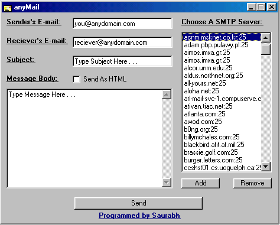



## anyMail

### Description

anyMail is an anonymous mailer. You can use it to send email without logging into an account. It uses the Winsock control in VB. It uses SMTP relaying to send the message to any e-mail address from any email address. It supports sending email in html format.
 
### More Info
 
Just specify a smtp server sender's e-mail receiver's e-mail anyMail will send the mail for you.

Not all smtp servers allow relaying without authorization. So it may not work on all the servers.

             |
---                |---
**Submitted On**   |2001-08-26 00:05:20
**By**             |[Saurabh Gupta](https://github.com/Planet-Source-Code/PSCIndex/blob/master/ByAuthor/saurabh-gupta.md)
**Level**          |Advanced
**User Rating**    |4.3 (166 globes from 39 users)
**Compatibility**  |VB 5\.0, VB 6\.0
**Category**       |[Complete Applications](https://github.com/Planet-Source-Code/PSCIndex/blob/master/ByCategory/complete-applications__1-27.md)
**World**          |[Visual Basic](https://github.com/Planet-Source-Code/PSCIndex/blob/master/ByWorld/visual-basic.md)
**Archive File**   |[anyMail253238252001\.zip](https://github.com/Planet-Source-Code/saurabh-gupta-anymail__1-26640/archive/master.zip)

